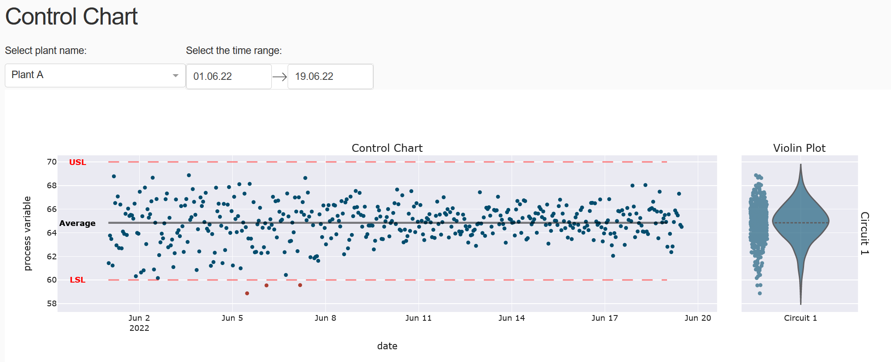

## About the dashboard

This dashboard is divided in two _Tabs_, which are complementary reports related to Capability control.

### I. Index Report

This report is divided in three columns, as shown in the example below.

The first two shows the index **PPK** for different time windows (Monthly and Daily), which is used to group the samples. The decision of using time is due to the fact that this example consider a Continuous Production Process, not a Discrete one.

The colors of the bars are defined by the calculated value and the variable _Goal PPK_, which is draw with the horizontal red line.
To have more details about the number of samples grouped, the specification limits, and also the Probability Distribution function considered (only Normal, in this case), the user can see the Hover text available. An example of the Hover text is shown below.

The last column show the Histogram of the group of samples for the selected month. Also, the curve of the fitted Normal distribution is drawn. This figure is more informative in the sense of understand the definition of the index **PPK**, rather than give an information to decision making. Therefore, I always suggest to maintain this graph in the report, given that it is an excellent tool for training.

The vertical red lines plotted in the Histogram plot are the specification limits.

### II. Control chart

The control chart is divided in two columns, the Control Chart and the Violin Plot. Below, we see an example of the chart.

The control chart is a scatter plot showing the sampling values with time. **Outliers** samples are plotted with the color red, as an indicative way to show that they are out of the specification range.
The specification limits are drawn as the horizontal red lines, while the average of the sample values as the horizontal black line.

> The control chart is a great way to check when **special causes of variation** are introduced or removed from the process. As an example, it is possible to check in the figure above that a possible cause of variation was removed between 8th and 11th of June. This possibility is sustained by the daily vision of the index report (_first figure_). It is interesting to see, however, that this fact is not shown in the monthly vision of the index report.

The Violin Plot, as the Histogram plot for the index report, is an interesting way to visualize the probability distribution of the sample values and that makes of it a great tool to understand the concept of the Capability control indices and to training.
