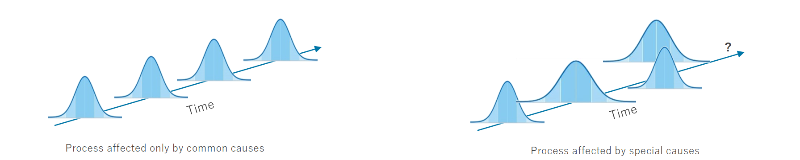

## I - Basics on Capability Control of Process

The objective of Process & Product Quality Control is to reduce the avoid loss due to non-conformability
of the manufactured product. Capability Control is one between some approaches that supports that objective,
by showing, either numerically or visually, when the product is attending the customer requirements or not.
In the case when the product present defects, i.e. the specifications are not attended, the Capability helps
to identify if this deviation is due to **Common** or **Special Cases of Variation**.

As can be deduced by the name, **Common Causes of Variation** are sources of deviation that are inherent to the process,
hence expected. These sources produce an observable distribution in the characteristics studied during the short time period.
On the other hand, **Special Causes of Variation** are sources that produces unpredictable deviation of the distribution of the
controlled variable.

When only common causes of variation are present, the processes are said to be in a **state of statistical control**.
They are stable and predictable. In case where special causes appear, the process becomes unstable and unpredictable,
hence is said to be **out of statistical control**. In the figure bellow, there is the simple comparison between the
two scenarios in terms of the probability distribution of the controlled variable.

### I.I - Cpk and Ppk indices

Cpk and Ppk are indices of process performance which tells how well a system is meeting specifications, that is,
they are parameter able to indicate when a special cause of variation is present. They have very similar definitions and the
choice between them depends of the characteristics of the process.

Consider a set of samples of the controlled variable $X = \{ x_1, x_2, \dots, x_n \}$ for which the specification limits are
$USL$ and $LSL$ (Upper and Lower Specification Limits, respectively). In the case where the probability distribution of the
variable under a **state of statistical control** is Gaussian, the index **Ppk** is defined as,

$$
P_{pk} = \text{min} \left( \frac{USL - \bar{X}}{3 \cdot \sigma} , \frac{\bar{X} - LSL}{3 \cdot \sigma} \right)
$$

Where $\bar{X}$ and $\sigma$ are the overall average and standard deviation of the set of samples $X$.

For a deeper understanding and for some examples, see the material written by Profs. Steiner, Abraham and MacKay
[here](https://sas.uwaterloo.ca/~shsteine/papers/cap.pdf).

### I.II - Control Chart

Cpk and Ppk indices are usually used combined with a Control Chart for decision making. The reason for this is that
in addition to the possibility to distinguish between common and special causes of variation, that the Control Chart
also presents, it provides the ability to estimate *when* the special cause appeared. There is a material about it on
Wikipedia [here](https://en.wikipedia.org/wiki/Control_chart).
